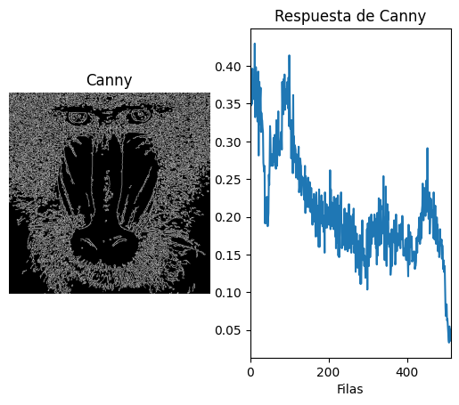
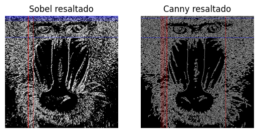
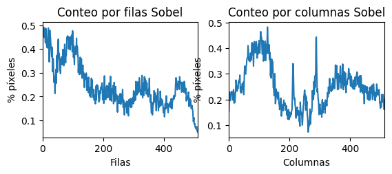
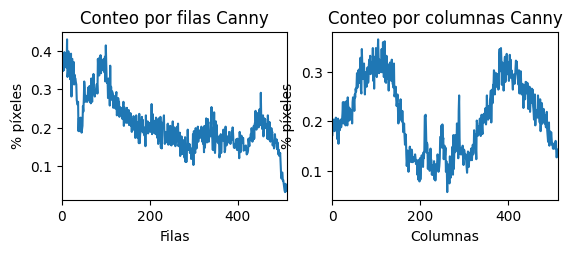
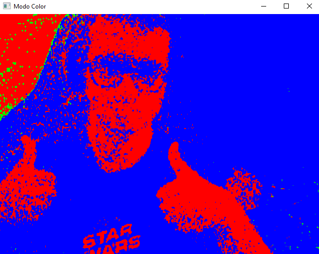
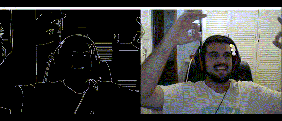
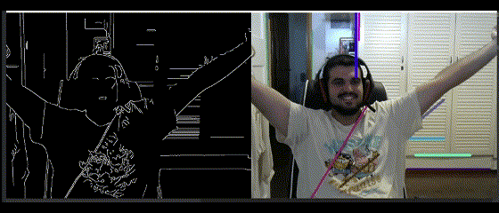

# PRÁCTICA 2. VISIÓN POR COMPUTADOR

> Trabajo realizado por:
> - David Koschel Henríquez
> - Pablo Nicolás Santana Hernández

### TAREA 1

Para esta tarea se copió el código existente del conteo de píxeles blancos en las columnas y se modificaron ciertos valores para realizar el conteo
por filas. Se cambió el segundo parámetro del _reduce_ a 1 para que cogiese las filas. Luego se normalizaron los datos
para que se muestren en porcentaje y se pinta el histograma. Además, se realizó el cálculo del _maxfil_, valor máximo de 
las filas, para poder compararlo y averiguar cuántas veces se daba el 95% de este valor o más.

El resultado obtenido es que este valor para la imagen del mandril es de 0.4296875 y su 95% del valor se da en dos ocaciones
en la fila 12 y la 100, así se muestra en la gráfica.

### TAREA 2
Para realizar esta tarea, partimos del código desarrollado en la tarea 1

#### Resultados obtenidos

#### Comparación Sobel vs Canny
En la comparativa de las gráficas podemos apreciar de que al aplicar Sobel el valor máximo es mayor, cerca del 50%
en el conteo de filas, mientras que Canny está en un 40% aproximadamente. En el conteo de columnas sucede lo mismo, Canny está
cerca del 35%-40% como valores más altos, mientras que el Sobel supera ligeramente el 40%.

Por otro lado, en las imágenes con las filas y columnas de mayor valor resaltadas, podemos ver que Sobel detecta un mayor
número de ambas. 

Es por todo esto, que concluimos que Sobel captura un mayor número de detalles mientras que Canny detecta bordes
más nítidos o mejor definidos.

### TAREA 3

Para esta tarea se decidió crear dos filtros.

El primero detecta el movimiento (contando los píxeles que han cambiado entre dos frames en cierto margen), y pixela la
imagen (reduciéndola y volviendo a ampliarla) dependiendo del movimiento que detecta. A mayor movimiento, más se pixela la
imagen.

Para mejor resolución [ver aquí](results/video.mp4)

El segundo filtra aplica una máscara para detectar cuál es el color RGB que más presente está en cada pixel, y solo
muestra ese color en su máximo valor.

### TAREA 4

Basándonos en el vídeo de "Messa di voce" decidimos aplicar al vídeo capturado un filtro Canny y sobre el frame generado 
pintar líneas en los bordes y círculos dentro de los contornos o recintos cerrados. Estos contornos deben de ser de un 
tamaño superior a 300 píxeles para ser detectado.

